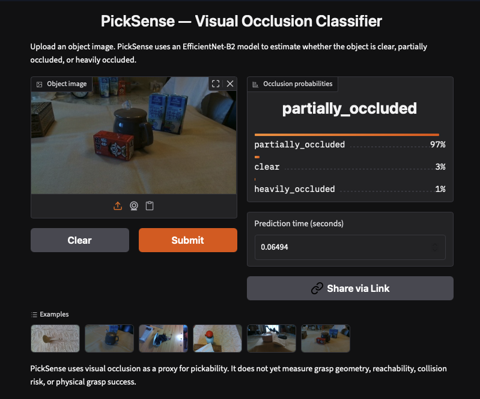

# PickSense

PickSense is a computer vision project that classifies the visual occlusion of an object as:

- **Clear**
- **Partially occluded**
- **Heavily occluded**

Visual occlusion is used as a proxy for how difficult an object may be to identify and pick.

> PickSense does not currently evaluate grasp geometry, reachability, collision risk, or physical grasp success.

## Video presentation

https://github.com/user-attachments/assets/a8b1f154-63a3-417b-8103-14c4472efe66

## Live application

Try PickSense using the deployed Hugging Face application:

### [Open PickSense on Hugging Face Spaces](https://huggingface.co/spaces/Thany/picksense)

Direct application URL:

**<https://thany-picksense.hf.space>**

## Application preview

[](https://huggingface.co/spaces/Thany/picksense)

Click the image to open the interactive application. Upload an object image to receive the probability for each occlusion class.

> The preview image must be saved as  
> `docs/images/picksense-hugging-face-app.png`.

## How it works

```text
Uploaded image
      │
      ▼
Convert image to RGB
      │
      ▼
Resize, crop, and normalize
      │
      ▼
PickSense EfficientNet-B2 model
      │
      ▼
Softmax probabilities
      │
      ├── Clear
      ├── Heavily occluded
      └── Partially occluded
```

The live application uses a trained EfficientNet-B2 classifier. The model is loaded once when the Hugging Face Space starts and is placed on a temporary ZeroGPU allocation when inference is requested.

The application performs inference only. Uploading an image does not retrain the model.

## Dataset

PickSense uses images from the `occlusion` condition of the [OpenLORIS-Object dataset](https://www.kaggle.com/datasets/zhedamai/openlorisobject).

The prepared dataset contains 3,600 balanced images:

| Split | Images per class | Total |
|---|---:|---:|
| Training | 1,000 | 3,000 |
| Testing | 200 | 600 |

The three dataset classes are:

| Class | OpenLORIS tasks | Approximate occlusion |
|---|---|---:|
| `clear` | `task1`, `task2`, `task3` | 0% |
| `partially_occluded` | `task4`, `task5`, `task6` | 25% |
| `heavily_occluded` | `task7`, `task8`, `task9` | 50% |

The original OpenLORIS training and testing boundaries are preserved to prevent data leakage.

The dataset is stored outside the Git repository in Google Drive:

```text
/content/drive/MyDrive/PickSense/data/
├── raw/
│   └── openloris/
│       └── occlusion/
└── picksense_mini/
    ├── train/
    │   ├── clear/
    │   ├── heavily_occluded/
    │   └── partially_occluded/
    └── test/
        ├── clear/
        ├── heavily_occluded/
        └── partially_occluded/
```

## Project workflow

The project is organized around three notebooks:

### 1. Prepare the dataset

`notebooks/00_download_prepare_data.ipynb`

- Downloads the OpenLORIS-Object dataset.
- Extracts the relevant occlusion images.
- Creates balanced training and testing splits.
- Stores the prepared dataset in Google Drive.
- Reuses existing data instead of downloading it again.

### 2. Train and evaluate

`notebooks/01_picksense_main.ipynb`

- Loads the prepared dataset.
- Creates PyTorch datasets and data loaders.
- Trains and evaluates the original PickSense model.
- Saves the resulting model checkpoint.

### 3. Compare and deploy models

`notebooks/model_deployment.ipynb`

- Trains and compares EfficientNet-B2 and ViT models.
- Measures accuracy, model size, and CPU inference time.
- Creates the Gradio application.
- Packages the EfficientNet-B2 checkpoint and deployment files.
- Uploads the application to Hugging Face Spaces.

## Repository structure

```text
picksense/
├── app/                              # Legacy local web application
│   ├── backend/                      # FastAPI inference backend
│   └── frontend/                     # Frontend application
├── data/                             # Local data-related files
├── docs/                             # Documentation and application images
│   └── images/
│       └── picksense-hugging-face-app.png
├── models/                           # Locally stored model checkpoints
│   └── pretrained_vit_picksense.pth
├── notebooks/
│   ├── 00_download_prepare_data.ipynb
│   ├── 01_picksense_main.ipynb
│   └── model_deployment.ipynb
├── reports/                          # Experiment reports and results
├── scripts/                          # Project scripts
├── src/                              # Reusable dataset and training code
├── .gitignore
├── README.md
└── requirements.txt
```

The root `app/` directory is a legacy local application. It is not used by the current Hugging Face deployment.

## Hugging Face deployment structure

The deployment notebook creates a separate, self-contained application directory:

```text
demos/
└── picksense/
    ├── README.md
    ├── app.py
    ├── model.py
    ├── requirements.txt
    ├── pretrained_effnetb2_picksense.pth
    └── examples/
        ├── clear_example.jpg
        ├── heavily_occluded_example.jpg
        └── partially_occluded_example.jpg
```

The contents of `demos/picksense/` are uploaded to the root of the Hugging Face Space.

The deployment files are generated in the notebook environment, so the `demos/` directory may not appear in the local repository until the deployment cells are run or the generated package is downloaded.

## Running the notebooks

### Google Colab

Clone the repository:

```bash
git clone https://github.com/thany-8/picksense.git
cd picksense
```

Run the dataset preparation notebook once:

```text
notebooks/00_download_prepare_data.ipynb
```

Then use either of the following:

```text
notebooks/01_picksense_main.ipynb
notebooks/model_deployment.ipynb
```

The notebooks use Google Drive paths under:

```text
/content/drive/MyDrive/PickSense/
```

## Running the deployment application locally

Download or generate the `demos/picksense/` directory, then run:

```bash
cd demos/picksense

python3 -m venv .venv
source .venv/bin/activate

python3 -m pip install --upgrade pip
python3 -m pip install -r requirements.txt

python3 app.py
```

Open the local Gradio URL printed in the terminal.

The deployed application expects these files to be in the same directory:

- `app.py`
- `model.py`
- `requirements.txt`
- `pretrained_effnetb2_picksense.pth`
- `examples/`

## Model limitations

PickSense currently predicts visual occlusion rather than real robotic pick success.

Performance may vary for:

- Images captured outside the OpenLORIS environment.
- Unfamiliar objects or backgrounds.
- Poor lighting and motion blur.
- Occlusion patterns that differ from the training dataset.
- Images containing several competing objects.

## Future work

- Evaluate the model using real robotic grasp outcomes.
- Improve generalization to phone and real-world warehouse images.
- Add grasp geometry and reachability information.
- Evaluate confidence calibration.
- Test additional model architectures and datasets.

## License and data attribution

The OpenLORIS-Object dataset remains subject to its original license and terms of use.

Project source code and model artifacts should be used according to the licenses included with this repository and its dependencies.